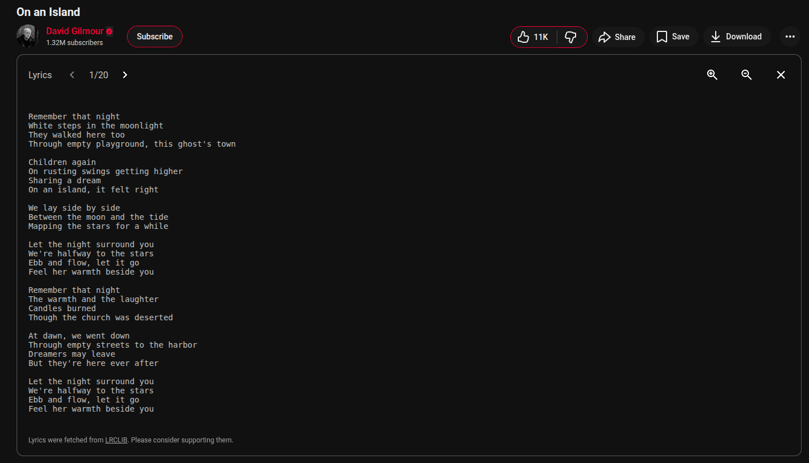

# YouLyric

YouLyric is a browser extension that injects lyrics under music videos on YouTube.

## Features

- Multiple versions of the lyrics, which you can scroll through using the scroll-left and scroll-right buttons
- Zoom in and out
- Manually searching for lyrics if the extension can't find it due to the method it uses to detect songs(more about it later).

## How it detects the songs

YouTube itself does half of the job here by providing attributes for most of the songs in the description. This extension then just extracts the title and author name from there as most of the time it's just plain text without any junk in it. Then it fetches the lyrics from [LRCLIB](https://lrclib.net/). Given how it detects the songs, many times it might fail to get the lyrics due to the attributes from YouTube itself might have junk in it. To solve that issue, I've added a feature to manually search for the song by providing title and author name.

**Special thanks to** [LRCLIB](https://lrclib.net/) **for providing this great source for lyrics for free!**

### ToDo

- Adding PIP feature
- Adding options to search for lyrics for videos that doesn't have any attributions
- Styles customization
