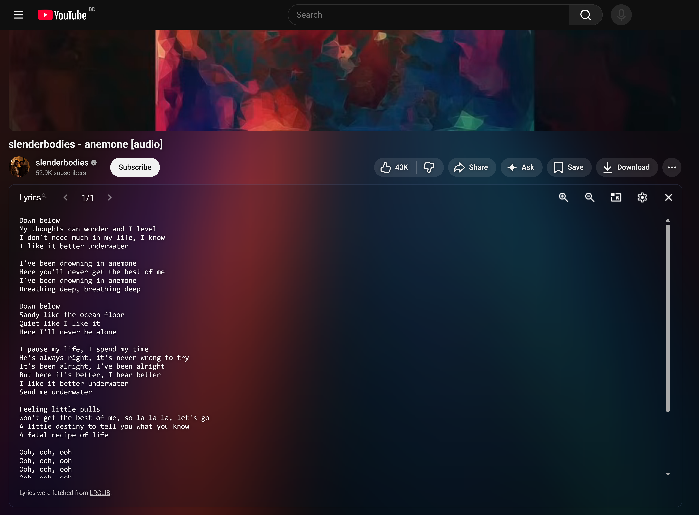
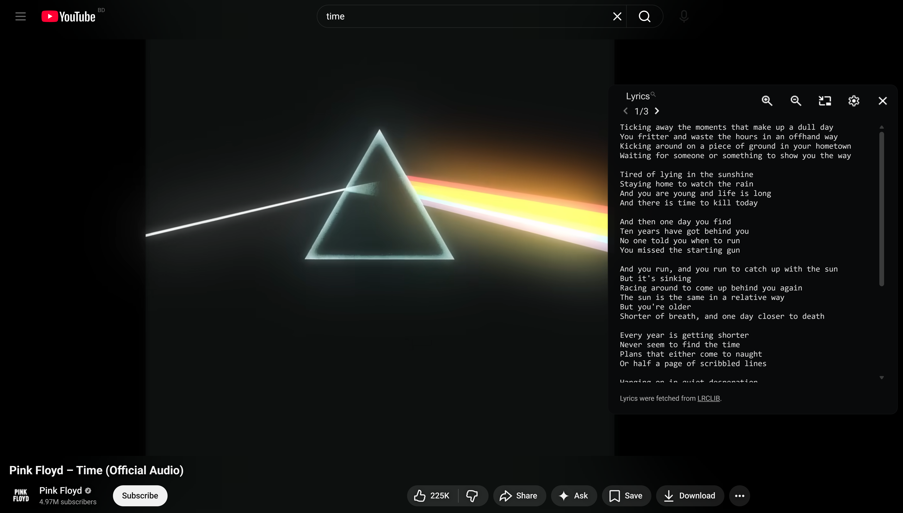

# YouLyric

It is a browser extension that injects lyrics in music videos on YouTube.






## Features

- You can dock it either in the description or the sidebar.
- You can use it in the Picture-in-picture mode.
- Multiple versions of the lyrics, which you can scroll through using the scroll-left and scroll-right buttons.
- Zoom in and out.
- You can do a manual search for the lyrics if the extension can't find metadata, if it has wrong metadata attached or if it fetches the wrong lyrics.
- Storing the manually searched song's info in IndexedDB, so that you don't have to type out the details everytime you run that video.
- You can customize the color to match your preference.

## How it detects the songs

YouTube itself does half of the job here by providing attributes for most of the songs in the description. This extension then just extracts the title and author name from there as most of the time it's just plain text without any junk in it. Then it fetches the lyrics from [LRCLIB](https://lrclib.net/). Given how it detects the songs, many times it might fail to get the lyrics due to the attributes from YouTube itself might have junk in it. To solve that issue, I've added a feature to manually search for the song by providing title and author name.

To build this app, simply run:

```
npm install && npm run build
```

**Special thanks to** [LRCLIB](https://lrclib.net/) **for providing this great source for lyrics for free!**

**YouLyric is a third-party extension and is not affiliated with YouTube or Google.**
